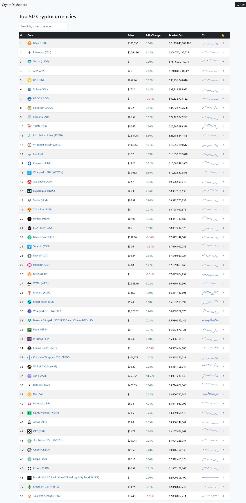
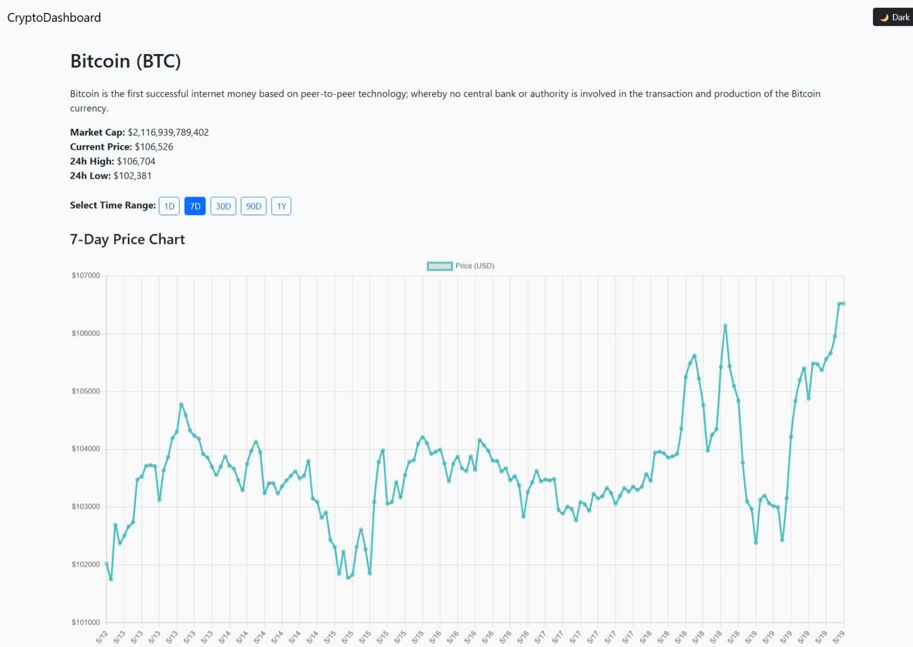
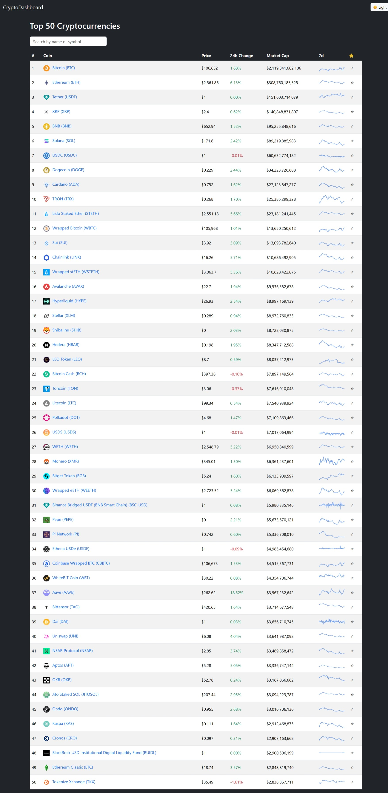
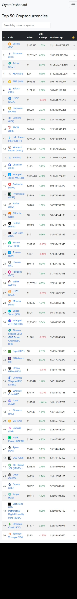

# 🚀 Crypto Dashboard

A modern, mobile-responsive cryptocurrency dashboard built with React, Bootstrap, and Chart.js. It provides real-time coin data, interactive charts, trending sections, and a user-friendly watchlist — all powered by the CoinGecko API.

---

## 🌐 Live Demo

[👉 View Live Project Here](https://crypto-dashboard-dfl1dt2mv-diegom339s-projects.vercel.app)  
<!-- Replace this with your actual Vercel or Netlify URL -->

---

## 🖥️ Features

- 🔍 Real-time search across top 50 cryptocurrencies
- 📈 7-day sparkline charts in the coin table
- 💹 Detailed coin pages with interactive time range (1D, 7D, 30D, 90D, 1Y)
- ⭐ Add/remove coins to a persistent watchlist (localStorage)
- 🔥 Trending coins section powered by CoinGecko's trending API
- 🌙 Dark/light theme toggle with state memory
- 📱 Fully responsive design for desktop, tablet, and mobile

---

## 🛠️ Tech Stack

- **Frontend**: React, Bootstrap 5
- **Data Visualization**: Chart.js via `react-chartjs-2`
- **Routing**: React Router DOM
- **API**: [CoinGecko Public API](https://www.coingecko.com/en/api)
- **Local Storage**: Watchlist and theme persistence
- **Hosting**: Deployed via [Netlify](https://www.netlify.com/) or [Vercel](https://vercel.com/)

---

## 📸 Screenshots

>

### 📈 Coin Detail Page


### 🌗 Dark Mode


### 📱 Mobile View


## 🚀 Getting Started

### Clone the repository

```bash
git clone https://github.com/Diegom339/crypto-dashboard.git
cd crypto-dashboard

npm install

npm start